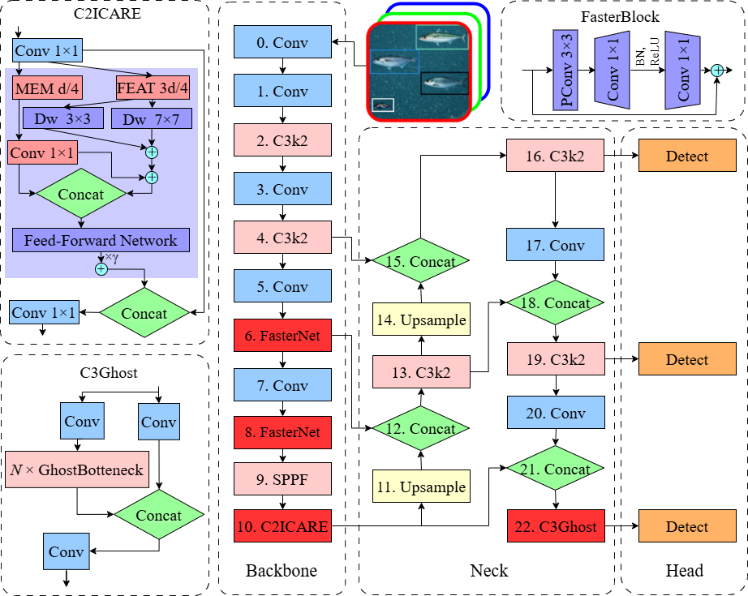

# C2ICARE‑Optimized YOLO for Real‑Time Marine Species Detection via Multi‑Scale Convolutional Design

[](https://www.gnu.org/licenses/agpl-3.0)
[](https://www.python.org/downloads/)
[](https://github.com/ultralytics/ultralytics)

**Official implementation of C2ICARE (Convolution to Interactive Capture and Re‑calibration Enhancement), a multi‑scale convolutional module that optimizes YOLO for real‑time marine species detection. It surpasses the YOLO26n baseline in accuracy by 12% while reducing GFLOPs by 1.3%.** 

---

## 📢 Updates

- `April 2026`: 🚀 Initial release of code and pretrained weights
- `April 2026`: 📄 Paper sent to journal

---

## 🏗️ Architecture

This section describes the architectural design of the proposed model. Figure 1 presents the complete YOLO26n-based architecture with the integrated modules (FasterBlock, C2ICARE, and C3Ghost), while Figure 2 details the internal structure of the C2ICARE module.

All baseline and ablation models (M0–M9) reported in Table 2 were **trained from scratch** to ensure a fair comparison of the architectural contributions. The pretrained weights provided in this repository (`best.pt`) correspond to the **M6 model after transfer learning**, initialised with COCO‑pretrained weights and fine‑tuned on the marine species dataset. This fine‑tuned version achieves a **mAP@0.5 of 0.9032**, demonstrating the benefits of transfer learning for real‑world deployment.

**We encourage researchers to test the proposed model on their own underwater datasets, explore longer training epochs to potentially improve performance, and evaluate the C2ICARE module within other Deep Learning architectures.** Your feedback and contributions are welcome.

### Complete Model Architecture

**Figure 1** shows the detailed architecture of the proposed YOLO26n-based model, integrating FasterBlock, C2ICARE, and C3Ghost modules for optimized fish detection in underwater cameras.

<p align="center">
  
  <br>
  <em>Figure 1. Detailed architecture of the proposed YOLO26n-based model, integrating FasterBlock, C2ICARE, and C3Ghost modules.</em>
</p>

### C2ICARE Module

The C2ICARE module is the core contribution of this work. It employs a partitioned memory‑feature split, multi‑scale depthwise convolutions (3×3 and 7×7), and a simplified cross‑branch projection to enhance multi‑scale feature extraction while maintaining low computational overhead.

<p align="center">
  
  <br>
  <em>Figure 2. Internal architecture of the proposed C2ICARE module.</em>
</p>

---

## 📊 Experimental Results

This section presents the quantitative and qualitative results of our experiments. We evaluate data augmentation strategies, training performance, detection metrics, multi‑objective optimization, and explainability analysis.

### Data Augmentation

To simulate the variability of underwater lighting conditions (which depend primarily on artificial illumination rather than ambient light), HSV shifts were applied with a hue shift range of ±0.5 and a saturation multiplier ranging from 0 to 2.

<p align="center">
  
  <br>
  <em>Figure 3. HSV augmentation grid for hue shift versus saturation factor. The centre cell (hue=0, saturation=1) corresponds to the original image.</em>
</p>

### Training Performance

The training was limited to 50 epochs (full convergence was not pursued). All reported values are averaged across three independent runs with random seeds 0, 1, and 2. Figure 4 shows the mAP@0.5 progression over epochs for all model variants (M0–M9).

<p align="center">
  
  <br>
  <em>Figure 4. Mean Average Precision (mAP@0.5) performance progress over 50 epochs, averaged across three independent runs (random seeds 0, 1, and 2). M0: YOLOv8n; M1: YOLO11n; M2: YOLO26n; M3: +FasterBlock; M4: +C2ICARE; M5: +C3Ghost; M6: +FasterBlock+C2ICARE; M7: +C2ICARE+C3Ghost; M8: +FasterBlock+C3Ghost; M9: all three modules.</em>
</p>

### Performance Metrics

Table 2 summarizes the performance metrics and computational complexity for all model configurations evaluated on the test split. Metrics include mAP@0.5, mAP@0.5:0.95, precision, recall, number of parameters, and GFLOPs.

| Model | FasterBlock | C2ICARE | C3Ghost | mAP@0.5 | mAP@0.5:0.95 | Precision | Recall | Parameters | GFLOPs |
|-------|-------------|---------|---------|---------|--------------|-----------|--------|------------|--------|
| M0 | | | | 0.5571 | 0.3071 | 0.5374 | 0.5853 | 3,006,428 | 8.088 |
| M1 | | | | 0.4892 | 0.2474 | 0.4795 | 0.5263 | 2,582,932 | 6.316 |
| M2 | | | | 0.5777 | 0.3325 | 0.5740 | 0.5475 | 2,375,616 | 5.193 |
| M3 | ✓ | | | 0.5672 | 0.3214 | 0.5617 | 0.5442 | 2,319,296 | 5.125 |
| M4 | | ✓ | | 0.6369 | 0.3715 | 0.6217 | 0.6034 | 2,334,112 | 5.160 |
| M5 | | | ✓ | 0.5798 | 0.3376 | 0.5658 | 0.5477 | 2,089,248 | 4.964 |
| M6 | ✓ | ✓ | | 0.6375 | 0.3800 | 0.6248 | 0.6029 | 2,277,792 | 5.093 |
| M7 | | ✓ | ✓ | 0.5550 | 0.3125 | 0.5356 | 0.5274 | 2,047,744 | 4.931 |
| M8 | ✓ | | ✓ | 0.5541 | 0.3137 | 0.5268 | 0.5740 | 2,032,928 | 4.897 |
| M9 | ✓ | ✓ | ✓ | 0.5406 | 0.3079 | 0.5230 | 0.5458 | 1,991,424 | 4.864 |

*M0 represents the YOLOv8n baseline; M1 denotes the YOLO11n baseline; M2 is the YOLO26n baseline. M3 to M9 are the proposed YOLO26n architectural variants.*

### Multi‑Objective Performance

To determine the viability of the proposed models for real‑time deployment, a multi‑objective analysis was performed. Figure 6 presents a radial performance comparison of all YOLO architectures (M0–M9), integrating mAP@0.5, LPS, GESI, PEI, and GFLOPs. The GFLOPs axis is inverted such that peripheral placement reflects lower computational demand and enhanced efficiency.

<p align="center">
  
  <br>
  <em>Figure 6. Radial performance comparison of YOLO architectures (M0–M9). The GFLOPs axis is inverted such that peripheral placement reflects lower computational demand and enhanced efficiency.</em>
</p>

### XAI Analysis: EigenCAM Visualisation

To validate that the **fine‑tuned M6 model** (obtained after transfer learning, mAP@0.5 = 0.9032) makes predictions based on fish morphology rather than spurious background cues, an EigenCAM analysis was performed on test images from both the 2017 and 2018 cruises. Figure 7 shows EigenCAM visualisations for this fine‑tuned M6 model on four test images. The colour coding for bounding boxes is as follows: mackerel (red), herring (green), bluewhiting (white), mesopelagic (yellow).

<p align="center">
  
  <br>
  <em>Figure 7a. EigenCAM visualisation for ST1_135-20180503160446316: 3 bluewhiting, 2 herring, 1 mesopelagic.</em>
</p>

<p align="center">
  
  <br>
  <em>Figure 7b. EigenCAM visualisation for ST6_6-20180506204859914: 6 mackerel, 5 herring.</em>
</p>

<p align="center">
  
  <br>
  <em>Figure 7c. EigenCAM visualisation for ST019-13-20170511204755726: 8 mackerel.</em>
</p>

<p align="center">
  
  <br>
  <em>Figure 7d. EigenCAM visualisation for ST033-864-607-20170520203304451: 2 bluewhiting, 12 herring.</em>
</p>
---

## 🚀 Quick Start

This section provides instructions to set up and run the proposed model.

### Prerequisites

- Python 3.8+
- CUDA 11.8 (for GPU training)
- PyTorch 1.10+
- Ultralytics YOLOv8.0.117+

### Dataset Preparation
```
📁 your_dataset/
├── 📁 images/
│   ├── 📁 train/
│   ├── 📁 val/
│   └── 📁 test/
├── 📁 labels/
│   ├── 📁 train/
│   ├── 📁 val/
│   └── 📁 test/
└── 📄 data.yaml
```
### 📄 License

This project is licensed under the GNU Affero General Public License v3.0 - see the LICENSE file for details.
This license requires that if you modify the code and provide a service over a network (e.g., a web API), you must make the complete source code available to users under the same license.

### 📚 Citation

This work acknowledges the foundational contributions of the research community. We thank Zhou et al. for their CARE Transformer [zhou2025care], which inspired our C2ICARE module. We also thank Allken et al. for the Deep Vision Fish Dataset and their deep learning methods for fish identification. If you find this work useful, please cite:

```bash
@article{SilvaAlvarado2026C2ICARE,
  title={C2ICARE‑Optimized YOLO for Real‑Time Marine Species Detection via Multi‑Scale Convolutional Design},
  author={Silva-Alvarado, Vinie Lee and Ahmad, Ali and Sendra, Sandra and Lloret, Jaime},
  journal={[Journal Name]},
  year={2026},
  note={Under review}
}

@inproceedings{zhou2025care,
  title={CARE Transformer: Mobile-Friendly Linear Visual Transformer via Decoupled Dual Interaction},
  author={Zhou, Yuan and Xu, Qingshan and Cui, Jiequan and Zhou, Junbao and Zhang, Jing and Hong, Richang and Zhang, Hanwang},
  booktitle={Proceedings of the Computer Vision and Pattern Recognition Conference},
  pages={20135--20145},
  year={2025}
}

@dataset{AllkenRosen2020DeepVisionFishDataset,
  author={Allken, Vaneeda and Rosen, Shale},
  title={Deep Vision Fish Dataset},
  year={2020},
  doi={10.21335/NMDC-551736490},
  url={https://doi.org/10.21335/NMDC-551736490}
}

@article{10.1093/icesjms/fsab227,
    author = {Allken, Vaneeda and Rosen, Shale and Handegard, Nils Olav and Malde, Ketil},
    title = {A deep learning-based method to identify and count pelagic and mesopelagic fishes from trawl camera images},
    journal = {ICES Journal of Marine Science},
    volume = {78},
    number = {10},
    pages = {3780-3792},
    year = {2021},
    month = {12},
    issn = {1054-3139},
    doi = {10.1093/icesjms/fsab227},
    url = {https://doi.org/10.1093/icesjms/fsab227},
    eprint = {https://academic.oup.com/icesjms/article-pdf/78/10/3780/41772702/fsab227.pdf},
}

@article{https://doi.org/10.1002/gdj3.114,
author = {Allken, Vaneeda and Rosen, Shale and Handegard, Nils Olav and Malde, Ketil},
title = {A real-world dataset and data simulation algorithm for automated fish species identification},
journal = {Geoscience Data Journal},
volume = {8},
number = {2},
pages = {199-209},
keywords = {data augmentation, fish dataset, machine learning, synthetic data},
doi = {https://doi.org/10.1002/gdj3.114},
url = {https://rmets.onlinelibrary.wiley.com/doi/abs/10.1002/gdj3.114},
eprint = {https://rmets.onlinelibrary.wiley.com/doi/pdf/10.1002/gdj3.114},
year = {2021}
}


```


