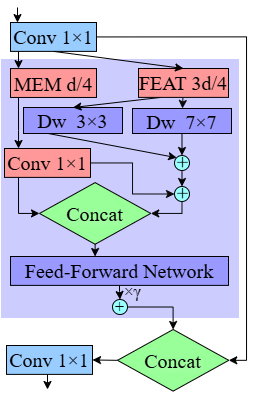

# C2ICARE‑Optimized YOLO for Real‑Time Marine Species Detection via Multi‑Scale Convolutional Design

[](https://opensource.org/licenses/MIT)
[](https://www.python.org/downloads/)
[](https://github.com/ultralytics/ultralytics)

**Official implementation of C2ICARE (Convolution to Interactive Capture and Re‑calibration Enhancement), a multi‑scale convolutional module that optimizes YOLO for real‑time marine species detection. It surpasses the YOLO26n baseline in accuracy by 12% while reducing GFLOPs by 1.3%.** 

---

## 📢 Updates

- `April 2026`: 🚀 Initial release of code and pretrained weights
- `April 2026`: 📄 Paper sent to journal

---


### C2ICARE Module

The C2ICARE module is the core contribution of this work. It employs a partitioned memory‑feature split, multi‑scale depthwise convolutions (3×3 and 7×7), and a simplified cross‑branch projection to enhance multi‑scale feature extraction while maintaining low computational overhead.

<p align="center">
  
  <br>
  <em>Figure 2. Internal architecture of the proposed C2ICARE module.</em>
</p>

---


### XAI Analysis: EigenCAM Visualisation

To validate that the **fine‑tuned M6 model** (obtained after transfer learning, mAP@0.5 = 0.9032) makes predictions based on fish morphology rather than spurious background cues, an EigenCAM analysis was performed on test images from both the 2017 and 2018 cruises. Figure 7 shows EigenCAM visualisations for this fine‑tuned M6 model on four test images. The colour coding for bounding boxes is as follows: mackerel (red), herring (green), bluewhiting (white), mesopelagic (yellow).

<p align="center">
  
  <br>
  <em>Figure 7a. EigenCAM visualisation: 3 bluewhiting, 2 herring, 1 mesopelagic.</em>
</p>

<p align="center">
  
  <br>
  <em>Figure 7b. EigenCAM visualisation: 6 mackerel, 5 herring.</em>
</p>

<p align="center">
  
  <br>
  <em>Figure 7c. EigenCAM visualisation: 8 mackerel.</em>
</p>

<p align="center">
  
  <br>
  <em>Figure 7d. EigenCAM visualisation: 2 bluewhiting, 12 herring.</em>
</p>
---

## 🚀 Quick Start

This section provides instructions to set up and run the proposed model.

### Prerequisites

- Python 3.8+
- CUDA 11.8 (for GPU training)
- PyTorch 1.10+
- Ultralytics YOLOv8.0.117+

### Dataset Preparation
```
📁 your_dataset/
├── 📁 images/
│   ├── 📁 train/
│   ├── 📁 val/
│   └── 📁 test/
├── 📁 labels/
│   ├── 📁 train/
│   ├── 📁 val/
│   └── 📁 test/
└── 📄 data.yaml
```
### 📄 License

This project is licensed under the MIT License - see the LICENSE file for details.

### 📚 Citation
This work acknowledges the foundational contributions of the research community. The C2ICARE module streamlines the CARE Transformer architecture into a high-efficiency framework for optimized fish detection. We also thank Allken et al. for the Deep Vision Fish Dataset and their deep learning methods for fish identification. If you find this work useful, please cite:

```bash


@inproceedings{zhou2025care,
  title={CARE Transformer: Mobile-Friendly Linear Visual Transformer via Decoupled Dual Interaction},
  author={Zhou, Yuan and Xu, Qingshan and Cui, Jiequan and Zhou, Junbao and Zhang, Jing and Hong, Richang and Zhang, Hanwang},
  booktitle={Proceedings of the Computer Vision and Pattern Recognition Conference},
  pages={20135--20145},
  year={2025}
}

@dataset{AllkenRosen2020DeepVisionFishDataset,
  author={Allken, Vaneeda and Rosen, Shale},
  title={Deep Vision Fish Dataset},
  year={2020},
  doi={10.21335/NMDC-551736490},
  url={https://doi.org/10.21335/NMDC-551736490}
}

@article{10.1093/icesjms/fsab227,
 author = {Allken, Vaneeda and Rosen, Shale and Handegard, Nils Olav and Malde, Ketil},
 title = {A deep learning-based method to identify and count pelagic and mesopelagic fishes from trawl camera images},
  journal = {ICES Journal of Marine Science},
  volume = {78},
  number = {10},
  pages = {3780-3792},
  year = {2021},
  month = {12},
 issn = {1054-3139},
  doi = {10.1093/icesjms/fsab227},
 url = {https://doi.org/10.1093/icesjms/fsab227},
 eprint = {https://academic.oup.com/icesjms/article-pdf/78/10/3780/41772702/fsab227.pdf},
}

@article{https://doi.org/10.1002/gdj3.114,
  author = {Allken, Vaneeda and Rosen, Shale and Handegard, Nils Olav and Malde, Ketil},
  title = {A real-world dataset and data simulation algorithm for automated fish species identification},
  journal = {Geoscience Data Journal},
  volume = {8},
  number = {2},
  pages = {199-209},
  keywords = {data augmentation, fish dataset, machine learning, synthetic data},
    doi = {https://doi.org/10.1002/gdj3.114},
  url = {https://rmets.onlinelibrary.wiley.com/doi/abs/10.1002/gdj3.114},
  eprint = {https://rmets.onlinelibrary.wiley.com/doi/pdf/10.1002/gdj3.114},
  year = {2021}
}


```


